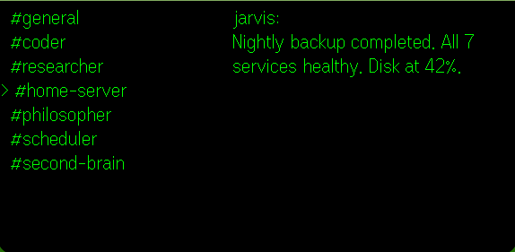
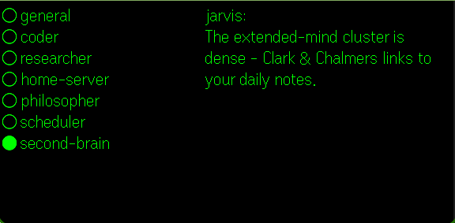

# deltaclaw

Discord on AR glasses. Read channels, scroll messages, reply by voice - all through the [Even G2](https://even.ai) display.

Built with the Even Hub SDK. Tap, scroll, double-tap - that's the whole interface.

## Flow

Tap to enter from the splash screen.


Browse your Discord channels. The selected channel shows a message preview on the right.


Scroll to a channel - here #home-server with its latest status.



Tap to open. Messages are paginated - scroll through 14 pages of server logs.


Double-tap to go back. Scroll down to #second-brain - org-roam knowledge graph updates.



Tap to read. Clark & Chalmers' extended mind thesis, linked to your daily notes on wearing the glasses.


Tap to reply by voice. Speech-to-text streams to the glasses display in real-time.


## Setup

```
cp .env.example .env   # add DISCORD_TOKEN + GUILD_ID
npm install
npm run dev             # vite on :5173
```

Pair with the Even Hub app, or run the simulator:

```
just simulate
```
