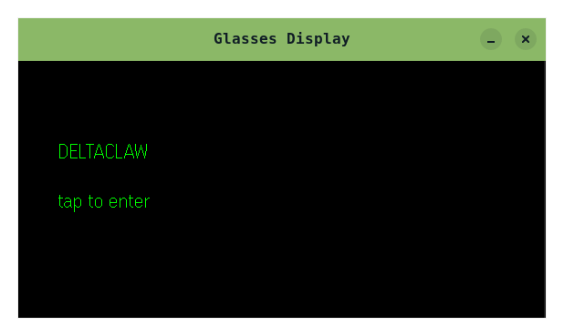
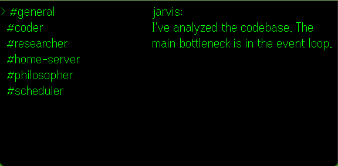
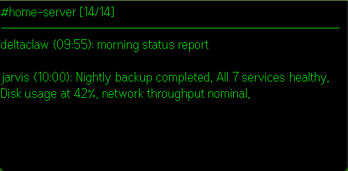
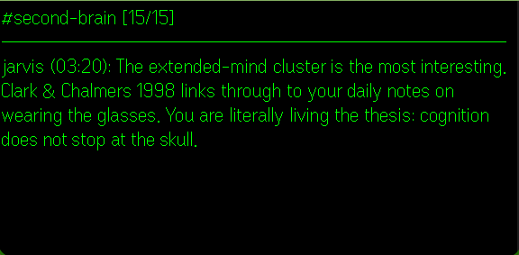
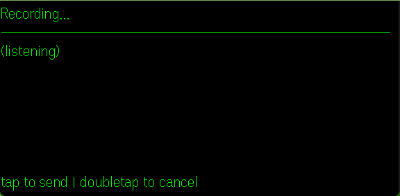

#+title: deltaclaw
#+description: Control openclaw from AR glasses, powered by voice.

AR glasses interface for [[https://github.com/mwlaboratories/openclaw][openclaw]]. Talk to your AI agents hands-free through [[https://www.evenrealities.com/][EvenRealities G2]] goggles.

#+begin_example
  tap → speak → agent receives instructions ✦ hands-free openclaw
#+end_example

* Why

One of the coolest ways to control openclaw is through Discord ([[https://youtu.be/vxpuLIA17q4][demo]]). Unlike a single Telegram or WhatsApp chat where everything gets lost in one stream, Discord gives you channels. Each channel is a separate agent, project, or workflow with its own history and pinned artifacts. Agents can run 24/7, chain outputs across channels, and stay organized.

deltaclaw puts all of that in your glasses:

- *Multichannel* : scroll between projects, each channel is a different agent/context
- *Parallel agents* : coding agent in one channel, research agent in another, all running
- *Persistent history* : full conversation per channel, agents pick up where you left off
- *Voice-first* : tap to record, speak, tap to send. No typing, no phone, no screen

* How it works

#+begin_example
┌──────────────────────────────────────────┐
│  EvenRealities G2 Goggles                │
│                                          │
│  deltaclaw web app                       │
│  ├── scroll/tap to browse channels       │
│  ├── tap to view messages                │
│  ├── tap to record → speak → tap to send │
│  │                                       │
│  │   Discord API (direct, bot token)     │
│  │   STT via stt-anywhere (optional)     │
│  │        or cloud provider              │
└──────────────────────┬───────────────────┘
                       │
         Tailscale / LAN / Internet
                       │
       ┌───────────────┼───────────────┐
       │                               │
       ▼                               ▼
┌──────────────┐              ┌──────────────┐
│  Discord API │              │ stt-anywhere  │
│  (channels,  │              │ (optional)    │
│   messages)  │              │              │
└──────────────┘              │ your GPU,    │
                              │ ~500ms,      │
                              │ free, local  │
                              └──────────────┘
#+end_example

** User flow

1. Open deltaclaw on glasses
2. Scroll through channels, tap to select
3. Read messages in the channel
4. Tap to record, speak your message
5. Tap to send (or double-tap to cancel)

* Architecture

#+begin_example
deltaclaw/
├── src/              Browser entry point (DOM setup, styles)
├── g2/               Glasses app logic
│   ├── app.ts          Wiring: store + bridge + event pipeline
│   ├── state/          Types, constants, reactive store
│   ├── render/         Text helpers, formatters, SDK container composers
│   ├── evenhub/        SDK bridge lifecycle
│   ├── input/          Event normalization + action mapping
│   ├── discord/        Discord REST client (direct API)
│   ├── stt/            WebSocket STT client
│   └── ui.tsx          Settings panel (React)
└── shared/           Shared types and logging
#+end_example

The glasses app talks directly to the Discord API (bot token configured in settings). For speech-to-text it connects to [[https://github.com/mwlaboratories/stt-anywhere][stt-anywhere]] over WebSocket, or a cloud STT provider.

* Prerequisites

- [[https://nixos.org/download/][Nix]] with flakes enabled
- [[https://www.evenrealities.com/][EvenRealities G2]] goggles (or use the simulator)
- Discord bot token (see setup below)
- For local STT: [[https://github.com/mwlaboratories/stt-anywhere][stt-anywhere]] on your network
- For cloud STT: paid provider (coming soon)

** Setting up the Discord bot

1. [[https://discord.com/developers/applications][Discord Developer Portal]] → New Application → name it "deltaclaw"
2. Bot tab → Reset Token → save the token
3. OAuth2 → URL Generator → select =bot= scope + =Send Messages= + =Read Message History=
4. Open the generated URL to invite the bot to your server
5. Right-click your server name → Copy Server ID (enable Developer Mode in settings first)
6. Enter the bot token and guild ID in the deltaclaw settings panel

* Development

Requires [[https://nixos.org/download/][Nix]] with flakes enabled.

#+begin_src sh
nix develop
#+end_src

This drops you into a ready environment with all dependencies installed. Available commands:

| Command          | Description                          |
|------------------+--------------------------------------|
| =just dev=       | Start Vite dev server                |
| =just simulate=  | Launch Even Hub simulator            |
| =just qr=        | QR code to sideload on glasses       |
| =just pack=      | Package =.ehpk= for submission      |

** Testing on glasses

1. =just dev= to start the dev server
2. =just qr= in another terminal to generate a QR code
3. Scan the QR with the Even app on your phone
4. The app loads on your G2 glasses, connected to your local server

** Testing locally

#+begin_src sh
just simulate
#+end_src

Launches the Even Hub simulator for local development without glasses.

* Stack

- TypeScript + React
- Vite
- [[https://evenhub.evenrealities.com/][Even Hub SDK]] (=@evenrealities/even_hub_sdk= v0.0.9)
- Even Hub CLI + Simulator
- WebSocket for STT streaming
